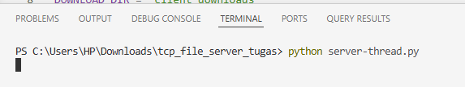
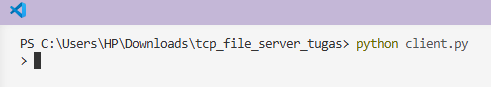
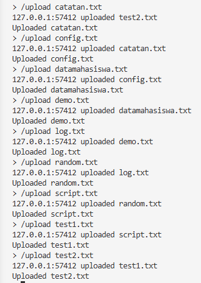
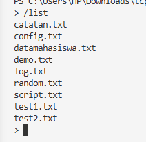
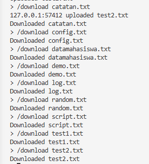

[](https://classroom.github.com/a/mRmkZGKe)
# Network Programming - Assignment G01

## Anggota Kelompok
| Nama           | NRP        | Kelas     |
| ---            | ---        | ----------|
| Nabilah Bunga Sulistia               | 5025241073           | D          |
| Callista Fidelya Roba Gultom               | 5025241086           | D          |

## Link Youtube (Unlisted)
Link ditaruh di bawah ini
```
https://youtu.be/dCrrTxeReFI?si=Xa2qgJ0GuF189d2Q
```

## Penjelasan Program
1.	TUJUAN
   
       Tujuan dari pembuatan program ini adalah untuk membangun TCP File Server yang dapat menangani beberapa client, mendukung proses upload dan download file, menampilkan daftar file yang tersedia di server, serta mengirim pesan broadcast antar client. Program ini juga dibuat untuk memahami cara kerja concurrency pada server menggunakan beberapa pendekatan, khususnya threading.

2.	PERANCANGAN SISTEM
   
       Sistem dirancang dengan model client-server menggunakan TCP socket. Program terdiri dari satu file client dan beberapa file server yang masing-masing mewakili model penanganan koneksi yang berbeda. Pada implementasi utama yang digunakan untuk pengujian, server dijalankan menggunakan server-thread.py.
Struktur sistem terdiri dari:
•	client.py sebagai pengirim perintah dari sisi client
•	server-thread.py sebagai server multi-client berbasis threading
•	server_storage/ sebagai folder penyimpanan file pada server
•	client_downloads/ sebagai folder hasil unduhan pada client
Protokol komunikasi yang digunakan adalah:
•	/list untuk menampilkan daftar file
•	/upload <nama_file> untuk mengirim file ke server
•	/download <nama_file> untuk mengambil file dari server
•	/msg <pesan> untuk mengirim broadcast
•	/quit untuk keluar dari program
Perancangan protokol ini dibuat agar perintah teks tidak bercampur dengan data file sehingga proses transfer lebih stabil.

3.	IMPLEMENTASI PROGRAM
   
       Implementasi program dilakukan dengan menggunakan bahasa Python dan modul socket untuk komunikasi jaringan. Pada file client.py, pengguna dapat mengetik perintah melalui terminal. Client kemudian mengirimkan perintah ke server sesuai format yang telah ditentukan. Pada file server-thread.py, setiap client yang terhubung akan ditangani oleh thread terpisah. Dengan cara ini, server dapat melayani lebih dari satu client secara bersamaan. File yang diupload dari client akan disimpan ke folder server_storage. Saat client melakukan download, server akan mengirim file yang diminta dan client menyimpannya ke folder client_downloads. Selain itu, server juga mendukung broadcast message. Ketika satu client mengirim pesan menggunakan /msg, pesan tersebut akan diteruskan ke client lain yang sedang terhubung.


## Screenshot Hasil
PENGUJIAN PROGRAM
   
Pengujian dilakukan dengan menjalankan program secara bertahap menggunakan terminal.

Langkah Pengujian

a.	Menjalankan server dengan perintah:
    python server-thread.py
    

b. Menjalankan client dengan perintah:
   python client.py
   
 

c. Mengetik perintah /upload test1.txt untuk mengunggah file dari client ke server.
 
 

d. Mengetik kembali perintah /list untuk memastikan file sudah tersimpan di server

  

e. Mengetik perintah /download test1.txt dll untuk mengunduh file dari server ke client

 

f. Mengetik perintah /msg halo semua client agar pesan dikirim ke client lain.

  

g. Menutup koneksi dengan perintah /quit

 


